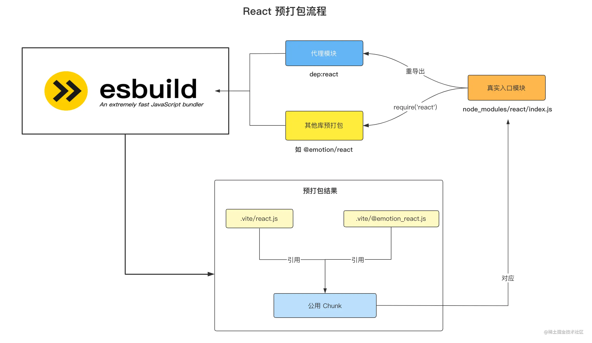
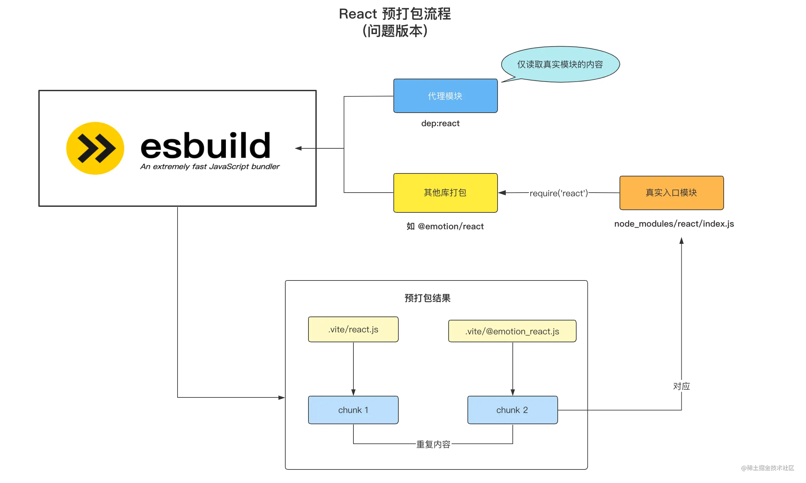

# Vite的实现

1. prescan 和 prebuild 位于目录`/src/node/optimizer`目录下。
  - 通过入口文件，首先进行预扫描，扫描入口文件所有的`bare import`，这一步是通过esbuild来进行，其实就是esbuild的打包过程，只不过没有写入也就是render的过程。通过预扫描，我们可以拿到一个`bare import`的set集合。如`import React from react`的类型称之为`bare import`。
  - 通过上一步收集到的`bare import`set集合。作为esbuild打包的入口文件，从项目下开始寻找，将非esm的模块打包到`node/modules/.vite`目录下。同时会将嵌套文件夹`扁平化`处理成a/b/react.js的形式。
  - 对于cjs转化成esm，我们需要中间过渡一下，使用`es-module-lexer`来对导入语句进行分析。
  ```javascript
  if (!imports.length && !exports.length) {
    const res = require(entryPath);
    const specifiers = Object.keys(res);
    // 重新导出，交给esbuild加载。
    proxyModule.push(
      `export { ${specifiers.join(',')} } from "${entryPath}"`,
      `export default require("${entryPath}")`
    )
  } else {
    // esm
    if (exports.includes("default")) {
      proxyModule.push(`import d from "${entryPath}"; export default d`)
    }
    proxyModule.push(`export * from "${entryPath}"`)
  }
   return {
    loader: loader as Loader,
    contents: proxyModule.join('\n'),
    resolveDir: root
  }
  ```

  这里的返回的contents是一个自己组装的代理模块，因为不用的地方用到同一份文件，可以避免重复打包。如图正确的打包如下
  

  直接加载文件内容如下，也就是错误的方式。
  

2.
  
