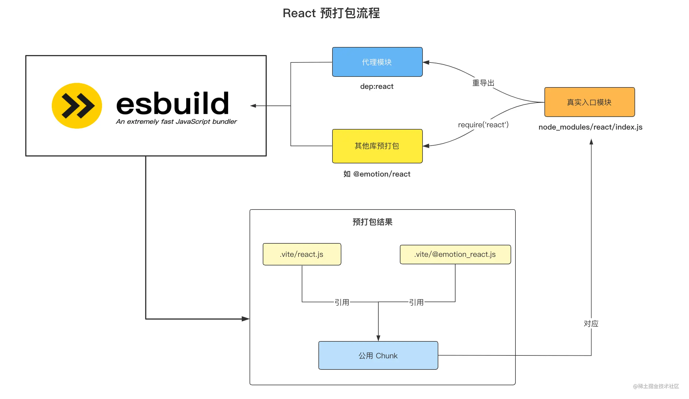
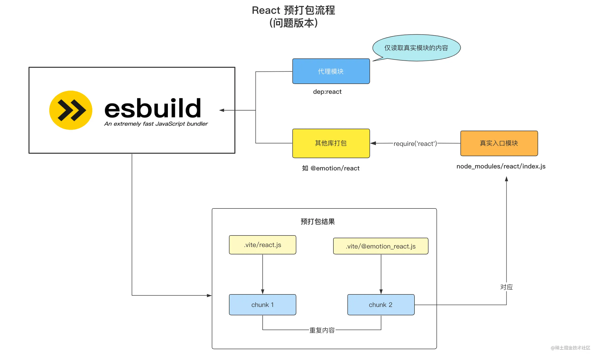
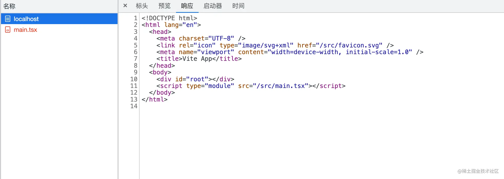

# Vite的实现

1. prescan 和 prebuild 位于目录`/src/node/optimizer`目录下。
  - 通过入口文件，首先进行预扫描，扫描入口文件所有的`bare import`，这一步是通过esbuild来进行，其实就是esbuild的打包过程，只不过没有写入也就是render的过程。通过预扫描，我们可以拿到一个`bare import`的set集合。如`import React from react`的类型称之为`bare import`。
  - 通过上一步收集到的`bare import`set集合。作为esbuild打包的入口文件，从项目下开始寻找，将非esm的模块打包到`node/modules/.vite`目录下。同时会将嵌套文件夹`扁平化`处理成a/b/react.js的形式。
  - 对于cjs转化成esm，我们需要中间过渡一下，使用`es-module-lexer`来对导入语句进行分析。
  ```javascript
  if (!imports.length && !exports.length) {
    const res = require(entryPath);
    const specifiers = Object.keys(res);
    // 重新导出，交给esbuild加载。
    proxyModule.push(
      `export { ${specifiers.join(',')} } from "${entryPath}"`,
      `export default require("${entryPath}")`
    )
  } else {
    // esm
    if (exports.includes("default")) {
      proxyModule.push(`import d from "${entryPath}"; export default d`)
    }
    proxyModule.push(`export * from "${entryPath}"`)
  }
   return {
    loader: loader as Loader,
    contents: proxyModule.join('\n'),
    resolveDir: root
  }
  ```

  这里的返回的contents是一个自己组装的代理模块，因为不用的地方用到同一份文件，可以避免重复打包。如图正确的打包如下
  

  直接加载文件内容如下，也就是错误的方式。
  

2. pluginContainer的实现

  - 实现如下的几个插件钩子
  ```javascript
  export interface Plugin {
    name: string;
    configureServer?: ServerHook;
    resolveId?: (
      id: string,
      importer?: string
    ) => Promise<PartialResolvedId | null> | PartialResolvedId | null;
    load?: (id: string) => Promise<LoadResult | null> | LoadResult | null;
    transform?: (
      code: string,
      id: string
    ) => Promise<SourceDescription | null> | SourceDescription | null;
    transformIndexHtml?: (raw: string) => Promise<string> | string;
  }
  ```

   - configureServer: 一般用于保存ctx对象，供后续的钩子调用,
   - resolveId: 将路径转化为以为绝对路径，并返回绝对路径的数据。
   - load: 根据对应的绝对路径，加载文件内容。
   - transform: 对上一步load的文件内容转化，例如翻译成es5代码。
   - trasnformIndexHtml: 对html模版进行修改。


3. 入口文件加载index.html
  首先要考虑的就是入口 HTML 如何编译和加载的问题，这里我们可以通过一个服务中间件，配合插件机制来实现。
  一般是实现一个函数，返回一个异步函数，入参包含了(req, res, next)参数，将需要的数据return出去。
  ```javascript
    export function indexHtmlMiddware(
      serverContext: ServerContext
    ): NextHandleFunction {
      return async (req, res, next) => {
        if (req.url === "/") {
          const { root } = serverContext;
          // 默认使用项目根目录下的 index.html
          const indexHtmlPath = path.join(root, "index.html");
          if (await pathExists(indexHtmlPath)) {
            const rawHtml = await readFile(indexHtmlPath, "utf8");
            let html = rawHtml;
            // 通过执行插件的 transformIndexHtml 方法来对 HTML 进行自定义的修改
            for (const plugin of serverContext.plugins) {
              if (plugin.transformIndexHtml) {
                html = await plugin.transformIndexHtml(html);
              }
            }

            res.statusCode = 200;
            res.setHeader("Content-Type", "text/html");
            return res.end(html);
          }
        }
        return next();
      };
    }
  ```
  以为我们使用了express启动的服务服务器，那么直接通过`app.use(xxx)`即可使用。

4. 上一步解决了入口文件的加载问题，那么可以得到html的返回内容。由于加载不出tsx文件，所以报错了。
  
  因此我们需要解决tsx，jsx的文件编译。主要就是调用plugin的方法
    - resolveId
    - load
    - transform
  然后将transform后的code返回。

  1. resolveId插件的实现。`入参(id, importer)`
    当浏览器遇到如下，会解析失败。因为无法定位到文件具体位置，所以需要resolveId插件实现。
      ```javascript
      <script type="module" src="/src/main.tsx"></script>
      ```

    具体判断逻辑
      - 绝对路径，存在的话返回路径。不存在加上项目目录，在判断是否存在，存在则返回绝对路径。
      - 如果相对路径，我们会有一个入参`improter`，意为导入该模块的模块。因此通过`path.dirname(importer)`得到上级目录，拼接上id即为绝对路径。
      - 如果遇到类似`./App`不带任何后缀的文件，会尝试为该路径加上`tsx, jsx, js, ts `后缀进行寻找，找到就返回绝对路径。

  2. transfrom插件实现
    1. load的时候，通过绝对路径，利用fs读取文件内容。返回code信息。
    2. transform则是利用esbuild的tranform功能。
    ```javascript
    const { code: transformedCode, map } = await esbuild.transform(code, {
        target: "esnext",
        format: "esm",
        sourcemap: true,
        loader: extname as "js" | "ts" | "jsx" | "tsx",
      });
    return {
        code: transformedCode,
        map,
      };
    ```

  3. 当将转化后的代码直接返回给浏览器执行，是不是就可以了？答案否定的。这里我们需要新起一个`importAnalysis`插件来将路径重写。
     1. 对于第三方依赖，重写路径，因为我们已经将第三方依赖写入了`.vite`目录下。
     2. 对于绝对路径和相对路径，需要借助之前的路径解析插件进行解析。

  经过上述步骤，页面已经可以正产渲染出来了。

5. css插件开发。
  我们需要加载css的样式，其实就是把css当做一个esm交给浏览器去去加载，transform钩子中做处理。
  ```javascript
  async transform(code, id) {
    if (id.endsWith(".css")) {
      // 包装成 JS 模块
      const jsContent = `
      const css = "${code.replace(/\n/g, "")}";
      const style = document.createElement("style");
      style.setAttribute("type", "text/css");
      style.innerHTML = css;
      document.head.appendChild(style);
      export default css;
      `.trim();
      return {
        code: jsContent,
      };
    }
  ```


 6. 模块图依赖的构建。
   模块依赖图在构建过程中是不可缺少的依赖，一方面可以存储各个模块的信息，用于记录编译缓存。另一方面可以记录模块之间的依赖关系。
   首先我们可以定一下一个模块会包含哪些内容。
   ```javascript
   export class ModuleNode {
    // 资源访问 url
    url: string;
    // 资源绝对路径
    id: string | null = null;
    // 该模块的引用方
    importers = new Set<ModuleNode>();
    // 该模块所依赖的模块
    importedModules = new Set<ModuleNode>();
    // 经过 transform 钩子后的编译结果
    transformResult: TransformResult | null = null;
    lastHMRTimestamp = 0;
    // 上一次热更新的时间戳
    constructor(url: string) {
      this.url = url;
    }
  }
  ```

  1. 此外我们还是实现一个`ModuleGraph`类，记录url到module的映射urlToMap和id到module的映射的idToMap。
  2. 在transform中间件中，我么可以拿到url，通过plguinContainer的resolveId()方法得到id，接着调用ModuleGraph类的`ensureFromUrl`方法，其实就是里如果urlMap存在那么这届闹大moduleNode,不存在，urlToMap和idToMap记录下来，返回该moduleNode。
  3. 在`importAnalysis`插件中，我们会分析import语句，因此我们可以得到当前模块所以来的模块。调用`moduleGraph.updateModuleInfo(curMod, importedModules)`来更新模块;
  ```javascript
    async updateModuleInfo(
      mod: ModuleNode,
      importedModules: Set<string | ModuleNode>
    ) {
      const prevImports = mod.importedModules;
      for (const curImports of importedModules) {
        const dep =
          typeof curImports === "string"
            ? await this.ensureEntryFromUrl(cleanUrl(curImports))
            : curImports;
        if (dep) {
          mod.importedModules.add(dep);
          dep.importers.add(mod);
        }
      }
      // 清除已经不再被引用的依赖
      for (const prevImport of prevImports) {
        if (!importedModules.has(prevImport.url)) {
          prevImport.importers.delete(mod);
        }
      }
    }
  ```
  通过不断的请求打入，一个模块图依赖被构建起来。

  7. HMR服务端
    1. 创建文件监听器，以监听文件的变动
    2. 创建 WebSocket 服务端，负责和客户端进行通信  
    3. 文件变动时，从 ModuleGraph 中定位到需要更新的模块，将更新信息发送给客户端   

  1. 通过chokdir来监听文件变动。
  ```javascript
  export async function startDevServer() {
    const watcher = chokidar.watch(root, {
      ignored: ["**/node_modules/**", "**/.git/**"],
      ignoreInitial: true,
    });
  }
  ```
  2. 创建websocket服务端。端口3000，
  ```javascript
    wss = new WebSocketServer({ port: 3000 });
  ```
  当监听到文件变动，那么会发送消息到客户端。

  8. HRM客户端。
    1. 创建 WebSocket 客户端，用于和服务端通信
    2. 在收到服务端的更新信息后，通过动态 import 拉取最新的模块内容，执行 accept 更新回调
    3. 暴露 HMR 的一些工具函数，比如 import.meta.hot 对象的实现
    客户端需要建立ws客户端。

    ```javascript
      // 1. 创建客户端 WebSocket 实例
      // 其中的 __HMR_PORT__ 之后会被 no-bundle 服务编译成具体的端口号
      const socket = new WebSocket(`ws://localhost:__HMR_PORT__`, "vite-hmr");  
      // 2. 接收服务端的更新信息
      socket.addEventListener("message", async ({ data }) => {
        handleMessage(JSON.parse(data)).catch(console.error);
      });
    ```

  如何将降本注入到客户端？新建一个inject plugin通过`transformIndexhtml`来插入一个一个脚本`<script type="module" src="${CLIENT_PUBLIC_PATH}></script>`。
  load时候回去读取相应目录下的文件。这样就把客户端脚本内注入到index.html。其中hmr更新函数理论上也会在客户端脚本中进行挂载。我们需要在业务源码中注入,在`importAnalysis`中进行注入，当然热更新的方法也需要再客户端脚本中添加。

    ```javascript
    if (!id.includes("node_modules")) {
    // 注入 HMR 相关的工具函数
    ms.prepend(
      `import { createHotContext as __vite__createHotContext } from "${CLIENT_PUBLIC_PATH}";` +
        `import.meta.hot = __vite__createHotContext(${JSON.stringify(
          cleanUrl(curMod.url)
        )});`
      );
    }
    ```

  至此，完成了mini-vite的构建工作。
